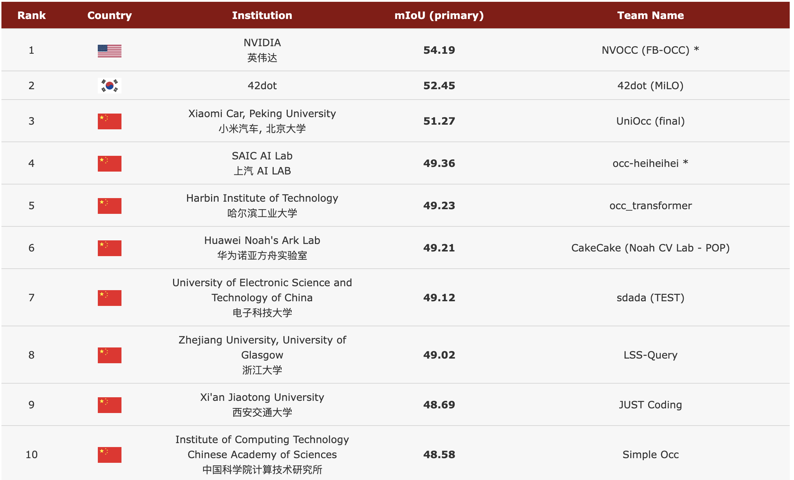
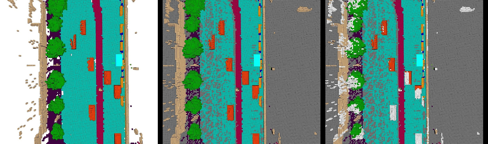

<div id="top" align="center">

# CVPR 2023 3D Occupancy Prediction Challenge
**The world's First 3D Occupancy Benchmark for Scene Perception in Autonomous Driving.**


<a href="#devkit">
  
</a>
<a href="#license">
  
</a>


</div>

## Introduction
Understanding the 3D surroundings including the background stuffs and foreground objects is important for autonomous driving. In the traditional 3D object detection task, a foreground object is represented by the 3D bounding box. However, the geometrical shape of the object is complex, which can not be represented by a simple 3D box, and the perception of the background stuffs is absent. The goal of this task is to predict the 3D occupancy of the scene. In this task, we provide a large-scale occupancy benchmark based on the nuScenes dataset. The benchmark is a voxelized representation of the 3D space, and the occupancy state and semantics of the voxel in 3D space are jointly estimated in this task. The complexity of this task lies in the dense prediction of 3D space given the surround-view images.

If you use the challenge dataset in your paper, please consider citing OccNet and Occ3D with the following BibTex:
```bibtex
@article{sima2023_occnet,
      title={Scene as Occupancy},
      author=author={Chonghao Sima and Wenwen Tong and Tai Wang and Li Chen and Silei Wu and Hanming Deng and Yi Gu and Lewei Lu and Ping Luo and Dahua Lin and Hongyang Li},
      year={2023},
      eprint={2306.02851},
      archivePrefix={arXiv},
      primaryClass={cs.CV}
}
```

```bibtex
@article{tian2023occ3d,
  title={Occ3D: A Large-Scale 3D Occupancy Prediction Benchmark for Autonomous Driving},
  author={Tian, Xiaoyu and Jiang, Tao and Yun, Longfei and Wang, Yue and Wang, Yilun and Zhao, Hang},
  journal={arXiv preprint arXiv:2304.14365},
  year={2023}
}
```

## Leaderboard 

### 3D Occupancy Prediction Challenge at CVPR 2023 (Server remains `active`)
Please refer to [this link](https://opendrivelab.com/AD23Challenge.html#Track3). If you wish to add new / modify results to the leaderboard, please drop us an email to <a href="mailto:contact@opendrivelab.com">contact@opendrivelab.com</a>
- Challenge webiste: [https://opendrivelab.com/AD23Challenge.html](https://opendrivelab.com/AD23Challenge.html)
  
Top 10 at a glance by June 10 2023. 


## Table of Contents
- [CVPR 2023 Occupancy Prediction Challenge](#cvpr-2023-occupancy-prediction-challenge)
  - [Introduction](#introduction)
  - [Leaderboard](#leaderboard)
  - [Task Definition](#task-definition)
    - [Rules for Occupancy Challenge](#rules-for-occupancy-challenge)
  - [Evaluation Metrics](#evaluation-metrics)
    - [mIoU](#miou)
    - [F Score](#f-score)
  - [Data](#data)
    - [Basic Information](#basic-information)
    - [Download](#download)
    - [Hierarchy](#hierarchy)
    - [Known Issues](#known-issues)
  - [Getting Started](#getting-started)
  - [Submission](#submission)
  - [Timeline](#challenge-timeline)
  - [License](#license)

## Changelog
* June 1: Challenge closed! Please refer to the final leaderboard at [here](https://opendrivelab.com/AD23Challenge.html#Track3).
* May 16: Note that it is a must to append a correct **email** address and other information to validate your submissions in the [Challenge](https://opendrivelab.com/AD23Challenge.html#rules).❗
* May 12: The [evaluation server](https://eval.ai/web/challenges/challenge-page/2045) is finally online! Check out [submission format](#submission) 
* April 18: 🚀 A strong baseline based on [InternImage](https://github.com/OpenGVLab/InternImage) released. Check out [here](https://github.com/OpenGVLab/InternImage/tree/master/autonomous_driving/occupancy_prediction).
* April 13: we add visualization code under utils/vis.py. And we add rules about using other datasets as well as future frame. Please take a look at the rule section and strickly follow them.

## Task Definition
Given images from multiple cameras, the goal is to predict the current occupancy state and semantics of each voxel grid in the scene. The voxel state is predicted to be either free or occupied. If a voxel is occupied, its semantic class needs to be predicted, as well. Besides, we also provide a binary observed/unobserved mask for each frame. An observed voxel is defined as an invisible grid in the current camera observation, which is ignored in the evaluation stage.

### Rules for Occupancy Challenge
* We allow using annotations provided in the nuScenes dataset, and during inference, the input modality of the model should be camera only. 
* No future frame is allowed during inference.
* In order to check the compliance, we will ask the participants to provide technical reports to the challenge committee and the participant will be asked to provide a public talk about the method after winning the award.
* Every submission provides method information. We encourage publishing code, but do not make it a requirement.
* Each team can have at most one account on the evaluation server. Users that create multiple accounts to circumvent the rules will be excluded from the challenge.
* Each team can submit at most three results during the challenge. 
* Faulty submissions that return an error on Eval AI do not count towards the submission limit.
* Any attempt to circumvent these rules will result in a permanent ban of the team or company from the challenge.

<p align="right">(<a href="#top">back to top</a>)</p>

## Evaluation Metrics
Leaderboard ranking for this challenge is by the intersection-over-union (mIoU) over all classes. 
### mIoU

Let $C$ be he number of classes. 

$$
    mIoU=\frac{1}{C}\displaystyle \sum_{c=1}^{C}\frac{TP_c}{TP_c+FP_c+FN_c},
$$

where $TP_c$ , $FP_c$ , and $FN_c$ correspond to the number of true positive, false positive, and false negative predictions for class $c_i$.

<p align="right">(<a href="#top">back to top</a>)</p>


## Data
<div id="top"  align="center">

</div>
<div id="top" align="center">
Figure 1. Semantic labels (left), visibility masks in the LiDAR (middle) and the camera (right) view. Grey voxels are unobserved in LiDAR view and white voxels are observed in the accumulative LiDAR view but unobserved in the current camera view.
</div>

### Basic Information
<div align="center">
  
| Type |  Info |
| :----: | :----: |
| mini            | 404 |
| train           | 28,130 |
| val             | 6,019 |
| test            | 6,008 |
| cameras         | 6 |
| voxel size      | 0.4m |
| range           | [-40m, -40m, -1m, 40m, 40m, 5.4m]|
| volume size     | [200, 200, 16]|
| #classes        | 0 - 17 |
  
</div>

- The dataset contains 18 classes. The definition of classes from 0 to 16 is the same as the [nuScenes-lidarseg](https://github.com/nutonomy/nuscenes-devkit/blob/fcc41628d41060b3c1a86928751e5a571d2fc2fa/python-sdk/nuscenes/eval/lidarseg/README.md) dataset. The label 17 category represents voxels that are not occupied by anything, which is named as `free`. Voxel semantics for each sample frame is given as `[semantics]` in the labels.npz. 

- <strong>How are the labels annotated?</strong> The ground truth labels of occupancy derive from accumulative LiDAR scans with human annotations, and we annotate the occupancy in the ego coordinate system. 
  - If a voxel reflects a LiDAR point, then it is assigned as the same semantic label as the LiDAR point;
  - If a LiDAR beam passes through a voxel in the air, the voxel is set to be `free`;
  - Otherwise, we set the voxel to be unknown, or unobserved. This happens due to the sparsity of the LiDAR or the voxel is occluded, e.g. by a wall. In the dataset, `[mask_lidar]` is a 0-1 binary mask, where 0's represent unobserved voxels. As shown in Fig.1(b), grey voxels are unobserved. Due to the limitation of the visualization tool, we only show unobserved voxels at the same height as the ground. 

- <strong>Camera visibility.</strong> Note that the installation positions of LiDAR and cameras are different, therefore, some observed voxels in the  LiDAR view are not seen by the cameras. Since we focus on a vision-centric task, we provide a binary voxel mask `[mask_camera]`, indicating whether the voxels are observed or not in the current camera view. As shown in Fig.1(c), white voxels are observed in the accumulative LiDAR view but unobserved in the current camera view.

- Both `[mask_lidar]` and `[mask_camera]` masks are optional for training. Participants do not need to predict the masks. Only `[mask_camera]` is used for evaluation; the unobserved voxels are not involved during calculating the F-score and mIoU.


### Download
The files mentioned below can also be downloaded via [OpenDataLab](https://opendatalab.com/CVPR2023-3D-Occupancy/download).It is recommended to use provided [command line interface](https://opendatalab.com/CVPR2023-3D-Occupancy/cli) for acceleration.

| Subset | Google Drive  | Baidu Cloud  | Size |
| :---: | :---: | :---: | :---: |
| mini | [data](https://drive.google.com/drive/folders/1ksWt4WLEqOxptpWH2ZN-t1pjugBhg3ME?usp=share_link) | [data](https://pan.baidu.com/s/1IvOoJONwzKBi32Ikjf8bSA?pwd=5uv6)  | approx. 440M |
| trainval  | [data](https://drive.google.com/drive/folders/1JObO75iTA2Ge5fa8D3BWC8R7yIG8VhrP?usp=share_link) | [data](https://pan.baidu.com/s/1_4yE0__UDIJS8JtBSB0Bpg?pwd=li5h) | approx. 32G |
| test | [data](https://drive.google.com/drive/folders/1hVs2AzSlEePN7QR502d8q7FoAbdJLxx8?usp=share_link) | [data](https://pan.baidu.com/s/1ElTu7i5gjXz3TwE2L0YBQQ?pwd=jstt) | approx. 6G |

* Mini and trainval data contain three parts -- `imgs`, `gts` and `annotations`. The `imgs` datas have the same hierarchy with the image samples in the original nuScenes dataset.


### Hierarchy
The hierarchy of folder `Occpancy3D-nuScenes-V1.0/` is described below:
```
└── Occpancy3D-nuScenes-V1.0
    |
    ├── mini
    |
    ├── trainval
    |   ├── imgs
    |   |   ├── CAM_BACK
    |   |   |   ├── n015-2018-07-18-11-07-57+0800__CAM_BACK__1531883530437525.jpg
    |   |   |   └── ...
    |   |   ├── CAM_BACK_LEFT
    |   |   |   ├── n015-2018-07-18-11-07-57+0800__CAM_BACK_LEFT__1531883530447423.jpg
    |   |   |   └── ...
    |   |   └── ...
    |   |     
    |   ├── gts  
    |   |   ├── [scene_name]
    |   |   |   ├── [frame_token]
    |   |   |   |   └── labels.npz
    |   |   |   └── ...
    |   |   └── ...
    |   |
    |   └── annotations.json
    |
    └── test
        ├── imgs
        └── annotations.json

```
- `imgs/` contains images captured by various cameras.
- `gts/` contains the ground truth of each sample. `[scene_name]` specifies a sequence of frames, and `[frame_token]` specifies a single frame in a sequence.
- `annotations.json` contains meta infos of the dataset.
- `labels.npz` contains `[semantics]`, `[mask_lidar]`, and `[mask_camera]` for each frame. 

```
annotations {
    "train_split": ["scene-0001", ...],                         <list> -- training dataset split by scene_name
    "val_split": list ["scene-0003", ...],                      <list> -- validation dataset split by scene_name
    "scene_infos" {                                             <dict> -- meta infos of the scenes    
        [scene_name]: {                                         <str> -- name of the scene.  
            [frame_token]: {                                    <str> -- samples in a scene, ordered by time
                    "timestamp":                                <str> -- timestamp (or token), unique by sample
                    "camera_sensor": {                          <dict> -- meta infos of the camera sensor
                        [cam_token]: {                          <str> -- token of the camera
                            "img_path":                         <str> -- corresponding image file path, *.jpg
                            "intrinsic":                        <float> [3, 3] -- intrinsic camera calibration
                            "extrinsic":{                       <dict> -- extrinsic parameters of the camera
                                "translation":                  <float> [3] -- coordinate system origin in meters
                                "rotation":                     <float> [4] -- coordinate system orientation as quaternion
                            }   
                            "ego_pose": {                       <dict> -- vehicle pose of the camera
                                "translation":                  <float> [3] -- coordinate system origin in meters
                                "rotation":                     <float> [4] -- coordinate system orientation as quaternion
                            }                
                        },
                        ...
                    },
                    "ego_pose": {                               <dict> -- vehicle pose
                        "translation":                          <float> [3] -- coordinate system origin in meters
                        "rotation":                             <float> [4] -- coordinate system orientation as quaternion
                    },
                    "gt_path":                                  <str> -- corresponding 3D voxel gt path, *.npz
                    "next":                                     <str> -- frame_token of the previous keyframe in the scene 
                    "prev":                                     <str> -- frame_token of the next keyframe in the scene
                }
            ]             
        }
    }
}
```

### Known Issues
- Nuscene ([issues-721](https://github.com/nutonomy/nuscenes-devkit/issues/721)) lacks translation in the z-axis, which makes it hard to recover accurate 6d localization and would lead to the misalignment of point clouds while accumulating them over whole scenes. Ground stratification occurs in several data.

<p align="right">(<a href="#top">back to top</a>)</p>

## Getting Started

We provide a baseline model based on [BEVFormer](https://github.com/fundamentalvision/BEVFormer).

Please refer to [getting_started](docs/getting_started.md) for details.

<p align="right">(<a href="#top">back to top</a>)</p>

## Submission

### Submission site
Please submit your result on our [evaluation server](https://eval.ai/web/challenges/challenge-page/2045). The submission rule can be referred to [here](#rules-for-occupancy-challenge)

### Submission format
We define a standardized 3D occupancy prediction result format that serves as an input to the evaluation code. Results are evaluated for each sample. The 3D occupancy prediction results for a the test evaluation set are stored in a folder. The participant needs to zip the results folder and submit it to the official evaluation server.

The folder structure of the results should be as follows:
```
└── results_folder
    ├── [frame_token].npz
    └── ...
```
The result folder contains .npz files, where each .npz file contains the labels of the voxels for the 3D grids with the shape of [200,200,16]. Pay special attention that each set of predictions in the folder must be a .npz file and named as `[frame_token]`.npz. The `[frame_token]` in `annotations.json` is the same as the `sample_token` in nuscenes. A .npz file contains an array of uint8 values in which each value is the predicted semantic class index of the corresponding grid in the 3D space.

Below is an example of how to save the predictions for a single sample:
```
save_path = os.path.join(submission_prefix,'{}.npz'.format(sample_token))
np.savez_compressed(save_path,occ_pred.astype(np.uint8))
```

We provide example scripts based on mmdetection3d to generate the submission file, please refer to [getting_started](docs/getting_started.md) for details.

The official evaluation server only accepts a single `*.zip` file; you can zip the results folder as below:
```
zip -r occ_submission.zip results_folder
```
<p align="right">(<a href="#top">back to top</a>)</p>

## Challenge Timeline
- May 12, 2023 - Challenge Period Open.
- Jun 01, 2023 11:59:00 PM CST(UTC+8) - Challenge Period End.
- Jun 03, 2023 - Finalist Notification.
- Jun 10, 2023 - Technical Report Deadline.
- Jun 12, 2023 - Winner Announcement.


<p align="right">(<a href="#top">back to top</a>)</p>

## License
Before using the dataset, you should register on the website and agree to the terms of use of the [nuScenes](https://www.nuscenes.org/nuscenes).
All code within this repository is under [MIT License](./LICENSE).

<p align="right">(<a href="#top">back to top</a>)</p>
