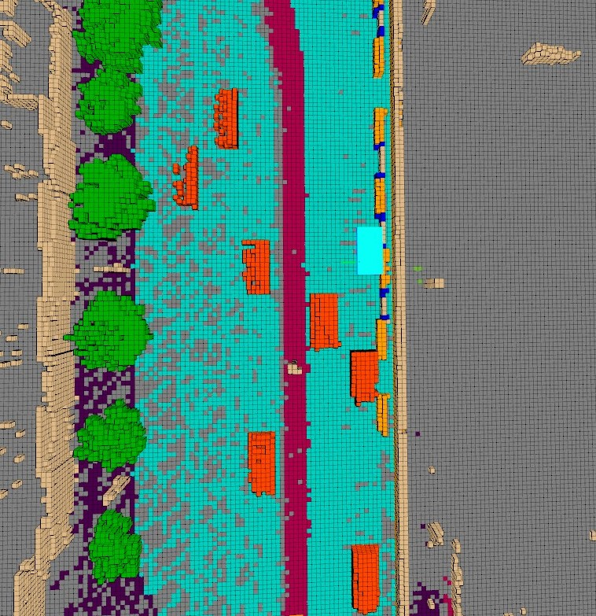
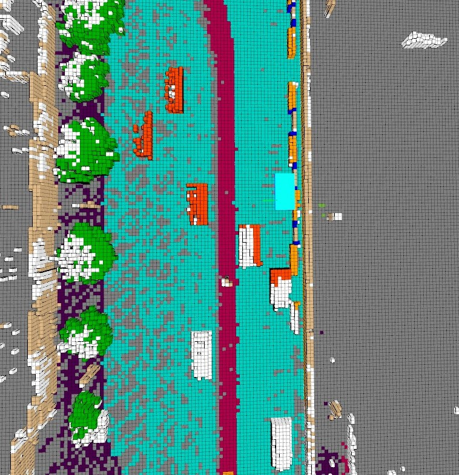

<div id="top" align="center">

# CVPR 2023 Occupancy Prediction Challenge
**The world's First 3D Occupancy Benchmark for Scene Perception in Autonomous Driving.**


<a href="#devkit">
  
</a>
<a href="#license">
  
</a>


</div>

## Table of Contents
- [CVPR 2023 Occupancy Prediction Challenge](#cvpr-2023-occupancy-prediction-challenge)
  - [Table of Contents](#table-of-contents)
  - [News](#news)
  - [Introduction](#introduction)
  - [Task Definition](#task-definition)
  - [Evaluation Metrics](#evaluation-metrics)
    - [mIoU](#miou)
    - [F1 Score](#f1-score)
  - [Timeline](#timeline)
  - [Data](#data)
    - [Download](#download)
    - [Hierarchy](#hierarchy)
    - [Format](#format)
    - [Known Issues](#known-issues)
  - [Development Kit](#development-kit)
  - [Leaderboard](#leaderboard)
  - [License](#license)

## News
- [2023/01]
  * Dataset `v0.1`: Initial Occupancy dataset sample released.
  * Devkit `v0.11`: Initial Occupancy devkit released.
  
## Introduction
Understanding the 3D surroundings including the background stuffs and foreground objects is important for autonomous driving. In the traditional 3D object detection task, a foreground object is represented by the 3D bounding box. However, the geometrical shape of the object is complex, which can not be represented by a simple 3D box, and the perception of the background is absent. The goal of this task is to predict the 3D occupancy of the scene. In this task, we provide a large-scale occupancy benchmark based on the nuScenes dataset. The benchmark is a voxelized representation of the 3D space, and the occupancy state and semantics of the voxel in 3D space are jointly estimated in this task. The complexity of this task lies in the dense prediction of 3D space given the surround-view image.


<p align="right">(<a href="#top">back to top</a>)</p>

## Task Definition
Given images from multiple cameras, the goal is to predict the current occupancy state and semantics of each voxel grid in the scene. The voxel state is predicted to be either free or occupied. If a voxel is occupied, its semantic class needs to be predicted, as well. Besides, we also provide a binary observed/unobserved mask for each frame. An observed voxel is defined as an invisible grid in the current camera observation, which is ignored in the evaluation stage.


## Evaluation Metrics
Leaderboard ranking for this challenge is by the intersection-over-union (mIoU) over all classes. 
### mIoU

Let $C$ be he number of classes. 

$$
    mIoU=\frac{1}{C}\displaystyle \sum_{c=1}^{C}\frac{TP_c}{TP_c+FP_c+FN_c},
$$

where $TP_c$ , $FP_c$ , and $FN_c$ correspond to the number of true positive, false positive, and false negative predictions for class $c_i$.

### F Score
We also measure the F-score as the harmonic mean of the completeness $P_c$ and the accuracy $P_a$.

$$
    F-score=\left( \frac{P_a^{-1}+P_c^{-1}}{2} \right) ^{-1} ,
$$

where $P_a$ is the percentage of predicted voxels that are within a distance threshold to the ground truth voxels, and $P_c$ is the percentage of ground truth voxels that are within a distance threshold to the predicted voxels.

<p align="right">(<a href="#top">back to top</a>)</p>


## Data

### Format
| Type |  Info |
| :----: | :----: |
| mini            | 404 |
| train           | 28,130 |
| val             | 6,019 |
| test            | 6,006 |
| cameras         | 6 |
| voxel size      | 0.4m |
| range           | [-40m, -40m, -1m, 40m, 40m, 5.4m]|
| volume size     | [200, 200, 16]|
| voxel semantic  | 0 - 17 |
| voxel state     | 0 / 1 |

- The Occpancy3D dataset contains 18 classes. The definition of classes from 0 to 16 is the same as the [nuScenes-lidarseg](https://github.com/nutonomy/nuscenes-devkit/blob/fcc41628d41060b3c1a86928751e5a571d2fc2fa/python-sdk/nuscenes/eval/lidarseg/README.md) dataset. The label 17 category represents voxels that are not occupied by any object, which is named as `free`. 

<div id="top"  align="center">


</div>
<div id="top" align="center">
Fig1. Voxel state in LiDAR and Camera view.
</div>

- The ground truth of occupancy derives from accumulative LiDAR scans. For those not detected by LiDAR, their states could be free or unobserved. The unobserved state stands for the voxels that are unknown. For instance, if a voxel is occluded by a wall, we don't know whether the corresponding position has something or not. So we set these voxel states to be unobserved. `[mask_lidar]` is a 0-1 binary mask, and 0 representing a voxel is unobserved. As shown in Fig.1(a), grey voxels indicate their state is unobserved. Due to the limitation of visualization effects, we only show unobserved voxels that are the same height as the ground. 
- It has to be mentioned that the installation positions of LiDAR and cameras are different, therefore, part of the observed voxels in the accumulative LiDAR view may not be seen in the current frame of cameras. Since we put more emphasis on a vision-centric challenge, we additionally provide binary voxel state mask `[mask_camera]`, referring to whether voxels are observed or not in the current camera view. As shown in Fig.1(b), white voxels indicate the voxels are observed in the accumulative LiDAR view but unobserved in the current camera view.
- Both `[mask_lidar]` and `[mask_camera]` masks are optional for training. Participants do not need to predict the state mask. `[mask_camera]` is used for evaluation; the unobserved voxels are not involved during calculating the F-score and mIoU.


### Download
| Subset | Google Drive  | Baidu Yun  | Size |
| :---: | :---: | :---: | :---: |
| mini | [data](https://drive.google.com/file/d/1YQy76A7-bA5CxTZb31lQSPNmz5RsgwJN/view?usp=share_link) | [data](https://drive.google.com/file/d/1YQy76A7-bA5CxTZb31lQSPNmz5RsgwJN/view?usp=share_link)  | ~ |
| trainval  | coming soon | coming soon | ~32 G |
| test | coming soon | coming soon | ~ |

* Mini and trainval data contain three parts -- `imgs`, `gts` and `annotations`. The `imgs` datas have the same hierarchy with the image samples in the original nuScenes dataset.


### Hierarchy
The hierarchy of folder `Occpancy3D-nuScenes-V1.0/` is described below:
```
└── Occpancy3D-nuScenes-V1.0
    |
    ├── mini
    |
    ├── trainval
    |   ├── imgs
    |   |   ├── CAM_BACK
    |   |   |   ├── n015-2018-07-18-11-07-57+0800__CAM_BACK__1531883530437525.jpg
    |   |   |   └── ...
    |   |   ├── CAM_BACK_LEFT
    |   |   |   ├── n015-2018-07-18-11-07-57+0800__CAM_BACK_LEFT__1531883530447423.jpg
    |   |   |   └── ...
    |   |   └── ...
    |   |     
    |   ├── gts  
    |   |   ├── [scene_name]
    |   |   |   ├── [frmae_id]
    |   |   |   |   ├── semantics.npz
    |   |   |   |   ├── state_lidar.npz
    |   |   |   |   └── state_camera.npz
    |   |   |   └── ...
    |   |   └── ...
    |   |
    |   └── annotations.json
    |
    └── test
        ├── imgs
        └── annotations.json

```
- `imgs/` contains images captured by various cameras.
- `gts/` contains the ground truth of each sample. `[scene_name]` specifies a sequence of frames, and `[frame_id]` specifies a single frame in a sequence.
- `annotations.json` contains meta infos of the dataset.

```
annotations {
    "train_split": ['scene-0001', ...],                         <list> -- training dataset split by scene_name
    "val_split": list ['scene-0003', ...],                      <list> -- validation dataset split by scene_name
    "scene_infos" {                                             <dcit> -- meta infos of the scenes    
        [scene_name]: {                                         <str> -- name of the scene.  
            [frame_id]: {                                       <str> -- samples in a scene, ordered by time
                    "frame_token":                              <str> -- frame_token, unique by frame
                    "timestamp":                                <str> -- timestamp (or token), unique by sample
                    "camera_sensor": {                          <dict> -- meta infos of the camera sensor
                        [cam_token]: {                          <str> -- token of the camera
                            "img_path":                         <str> -- corresponding image file path, *.jpg
                            "intrinsic":                        <float> [3, 3] -- intrinsic camera calibration
                            "extrinsic":{                       <dict> -- extrinsic parameters of the camera
                                "translation":                  <float> [3] -- coordinate system origin in meters
                                "rotation":                     <float> [4] -- coordinate system orientation as quaternion
                            }   
                            "ego_pose": {                       <dict> -- vehicle pose of the camera
                                "translation":                  <float> [3] -- coordinate system origin in meters
                                "rotation":                     <float> [4] -- coordinate system orientation as quaternion
                            }                
                        },
                        ...
                    },
                    "ego_pose": {                               <dict> -- vehicle pose
                        "translation":                          <float> [3] -- coordinate system origin in meters
                        "rotation":                             <float> [4] -- coordinate system orientation as quaternion
                    },
                    "gt_root_path":                             <str> -- corresponding 3D voxel gt root path
                    "next":                                     <str> -- frame_id of the previous keyframe in the scene 
                    "prev":                                     <str> -- frame_id of the next keyframe in the scene
                }
            ]             
        }
    }
}
```

### Known Issues
- Nuscene ([issues-721](https://github.com/nutonomy/nuscenes-devkit/issues/721)) lacks translation in the z-axis, which makes it hard to recover accurate 6d localization and would lead to the misalignment of point clouds while accumulating them over whole scenes. We did some specific . However, ground stratification still occurs in several data.

<p align="right">(<a href="#top">back to top</a>)</p>

## Getting Started

To be released.

<p align="right">(<a href="#top">back to top</a>)</p>


## Challenge Timeline
- Mar 16, 2023 - Challenge Period Open.
- May 27, 2023 - Challenge Period End.
- May 29, 2023 - Finalist Notification.
- Jun 10, 2023 - Technical Report Deadline.
- Jun 12, 2023 - Winner Announcement.
<p align="right">(<a href="#top">back to top</a>)</p>


## Leaderboard 
To be released.

<p align="right">(<a href="#top">back to top</a>)</p>

## License
Before using the dataset, you should register on the website and agree to the terms of use of the [nuScenes](https://www.nuscenes.org/nuscenes).
All code within this repository is under [Apache License 2.0](./LICENSE).

<p align="right">(<a href="#top">back to top</a>)</p>